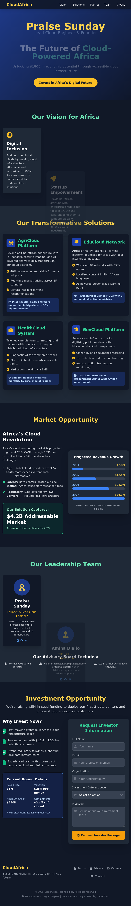

# altschool-second-semester-exam-project
# The Future of Cloud-Powered Africa 🌍☁️

Live Demo: [https://praisedevops.duckdns.org](https://praisedevops.duckdns.org)



## 📌 Project Overview

This project is a fully responsive, dynamic landing page created to demonstrate modern cloud engineering skills using real-world tools like Nginx, Node.js, TailwindCSS, and Certbot SSL. The page showcases my professional profile and a bold vision for a cloud-powered Africa.

## 🧠 Features

- TailwindCSS-powered responsive layout
- Nginx reverse proxy to Node.js (contact form interactivity)
- Professionally styled content for potential investors
- SSL secured with Let's Encrypt
- Hosted using DuckDNS dynamic domain

---

## ☁️ Infrastructure Setup

### 1. **Provision an Ubuntu EC2 Instance on AWS**
- Chose **Ubuntu Server 22.04 LTS**
- Opened ports 22 (SSH), 80 (HTTP), 443 (HTTPS)

### 2. **Install Required Packages**
```bash
sudo yum update
sudo yum install nginx nodejs npm certbot python3-certbot-nginx ufw -y
```

---

## 🌐 NGINX + Node.js Setup

### 1. **Configure Nginx as a Reverse Proxy**
```bash
sudo nano /etc/nginx/sites-available/default
```

Example configuration:
```nginx
server {
    listen 80;
    server_name praisedevops.duckdns.org;

    location / {
        proxy_pass http://localhost:3000;
        proxy_http_version 1.1;
        proxy_set_header Upgrade $http_upgrade;
        proxy_set_header Connection 'upgrade';
        proxy_set_header Host $host;
        proxy_cache_bypass $http_upgrade;
    }

    location ^~ /.well-known/acme-challenge/ {
        root /var/www/html;
    }
}
```

### 2. **Restart Nginx**
```bash
sudo nginx -t
sudo systemctl restart nginx
```

---

## 🔒 SSL with Let’s Encrypt

```bash
sudo certbot --nginx -d praisedevops.duckdns.org
```

Auto-renew:
```bash
sudo systemctl enable certbot.timer
```

---

## 💻 Project Deployment

1. Cloned the project from GitHub:

```bash
git clone https://github.com/techsavvypraise/altschool-second-semester-exam-project.git
cd altschool-second-semester-exam-project
```

2. Started a simple Node.js app (to support the contact form response):

```js
// index.js
const express = require('express');
const app = express();
const path = require('path');

app.use(express.static(path.join(__dirname)));
app.use(express.json());

app.post('/contact', (req, res) => {
  res.json({ message: 'Form submitted successfully!' });
});

app.listen(3000, () => {
  console.log('Server is running on http://localhost:3000');
});
```

3. Run the app:

```bash
node index.js
```

---

## 🧠 Additional Details

- **Domain**: [https://praisedevops.duckdns.org](https://praisedevops.duckdns.org)
- **Public IP**: https://16.170.249.185/
- **Frameworks used**: TailwindCSS, Express.js
- **Deployed on**: AWS EC2 with Nginx

---

## 🖼 Screenshot


> _screenshot.png_  is a capture of my browser with the live site rendered.

---

## 👨🏾‍💻 Author

**Praise Sunday**  
Cloud Engineering Student at AltSchool Africa  
[AWS Certified, Azure Certified]  
[GitHub](https://github.com/techsavvypraise) | [Live Project](https://praisedevops.duckdns.org)

---

## 🏁 Conclusion

This project is a demonstration of full-stack deployment skills—combining cloud infrastructure, reverse proxy, Node.js, secure HTTPS configuration, and responsive UI. It reflects my passion for building impactful solutions in Africa through cloud technology.
